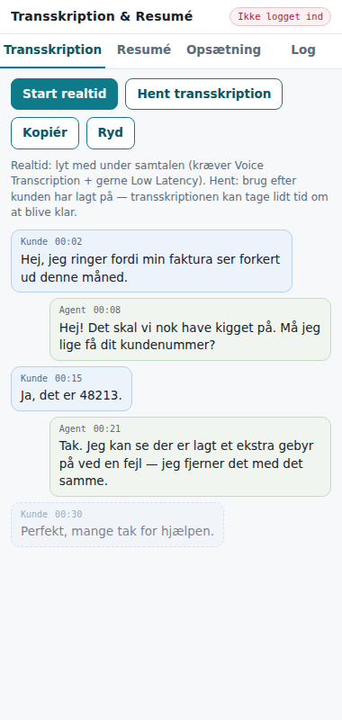
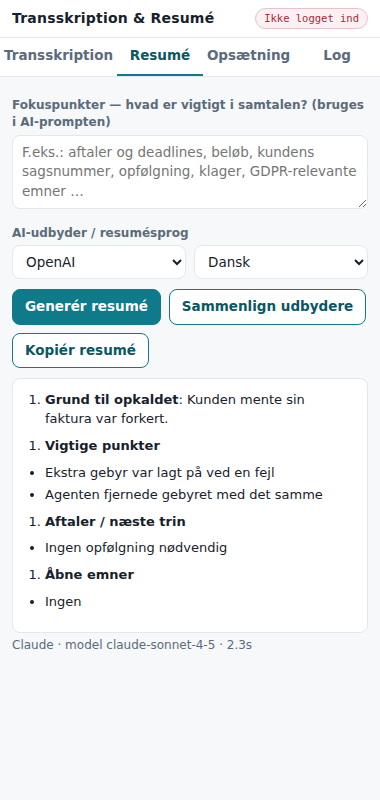
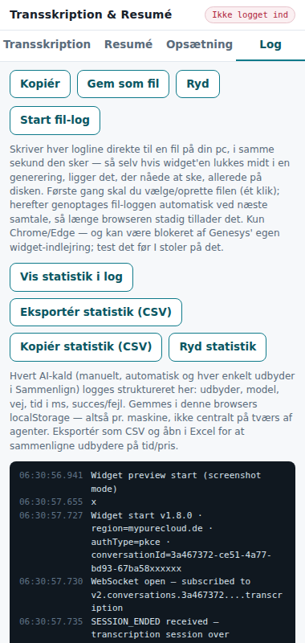
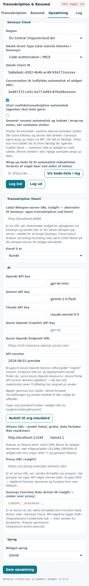

# Genesys Cloud Transcript & AI Resumé Widget

Interaction Widget til Genesys Cloud, der viser samtalens transskription og genererer et AI-resumé, som agenten kan sætte ind i wrap-up-noter **inden** der trykkes *Done* — også når kunden har lagt på.

Flad filstruktur (`index.html` + `app.js` + `i18n.js`) — kan uploades direkte via GitHub-webinterfacet og hostes på GitHub Pages.

## Skærmbilleder

> Gem de vedhæftede billeder i en `screenshots/`-mappe i repoet, så linksne herunder virker på GitHub.

**Transskription** — realtid, kunde/agent-adskilt med tidsstempler:


**Resumé** — formateret AI-resumé med tidsforbrug:


**Log** — struktureret hændelseslog til fejlsøgning:


**Opsætning** — Genesys Cloud, transskription, AI-udbydere (inkl. Azure OpenAI) og org-standard:


## To måder at få transskriptionen

| Metode | Hvornår | Krav |
|---|---|---|
| **Realtid** (Notifications API, topic `v2.conversations.{id}.transcription`) | Under samtalen — teksten strømmer ind løbende | Voice Transcription aktiveret på kø/flow. Slå **Low Latency Transcription** til (Admin → Speech and Text Analytics → Settings) for 3-5 sek. latenstid i stedet for ~35 sek. Permission: `conversation:transcription:view` |
| **Hent** (`GET /api/v2/speechandtextanalytics/.../transcripturl`) | I efterbehandling (ACW), efter kunden har lagt på. Kan tage 1-2 min. om at blive klar | Voice Transcription aktiveret. Permissions: `speechAndTextAnalytics:data:view`, `recording:recording:view` |

Anbefaling: start **Realtid** når samtalen begynder — så er hele transskriptionen klar i widget'en i samme sekund kunden lægger på, og resuméet kan genereres med det samme. Widget'en registrerer selv `SESSION_ENDED` og fortæller agenten, at resuméet kan laves.

## AI-resumé

Understøtter fem udbydere (nøgler gemmes kun i browserens localStorage og sendes direkte til udbyderen, medmindre Proxy eller Data Action er sat op — se "Nøglehåndtering" nedenfor):

- **OpenAI** (`gpt-4o-mini` som standard)
- **Google Gemini** (`gemini-flash-latest` — alias der altid peger på Googles aktuelle Flash-model; `gemini-2.0-flash` blev lukket 1. juni 2026)
- **Anthropic Claude** (`claude-sonnet-4-5`)
- **Azure OpenAI (Copilot)** — API-nøgle + endpoint-URL + deployment-navn + API-version. Det er det, de fleste virksomheder mener, når de siger "Copilot" internt.
- **Ollama (lokal)** — gratis, kører på egen maskine/server, data forlader aldrig organisationen.

Fra v1.8.0 kan admin også sætte en **org-standard** for alle agenter centralt via widget-URL'en (`orgActionId`/`orgProxyUrl`), uden at nogen API-nøgle nogensinde når agenternes browsere — se afsnittet om v1.8.0 i changelog'en nedenfor.

**Fokuspunkter**: fritekstfelt hvor man definerer, hvad der er vigtigt i samtalerne (aftaler, beløb, sagsnumre, klager, GDPR-emner …). Teksten injiceres i AI-prompten. Resumésprog kan vælges uafhængigt af UI-sprog.

UI-sprog: dansk, engelsk, fransk, tysk — vælges automatisk ud fra `{{gcLangTag}}` eller manuelt.

## Opsætning i Genesys Cloud

### 1. OAuth-klient
Admin → Integrations → OAuth → **Add Client**
- Grant type: **Code Authorization** med PKCE (Implicit Grant understøttes ikke længere fra v1.9.0)
- Authorized redirect URI: `https://<dit-github-brugernavn>.github.io/<repo>/index.html` (og evt. uden `index.html`)
- Scope: `conversations`, `speech-and-text-analytics`, `notifications`
- Kopiér Client ID ind i widget'ens Opsætning-fane.

### 2. Interaction Widget-integration
Admin → Integrations → **Add Integration** → *Interaction Widget*
- Application URL:
  ```
  https://<bruger>.github.io/<repo>/index.html?conversationId={{gcConversationId}}&langTag={{gcLangTag}}
  ```
  Til produktion: tilføj org-parametrene (`orgActionId`, `orgLock=1` …), se afsnittet **Sikkerhed** nedenfor.
- Iframe sandbox options: `allow-scripts,allow-same-origin,allow-forms,allow-popups,allow-downloads` (`allow-downloads` er nødvendig for "Gem som fil", "Hent forrige log" og CSV-eksport)
- Iframe feature permissions: `clipboard-write`
- Communication type filtering: `call` (eller tom for alle)
- Aktivér integrationen og tildel den til de relevante grupper.

### 3. Transskription
- Admin → Conversation Intelligence → Speech and Text Analytics → Settings:
  - Voice Transcription: **Enabled** (Queue configuration eller Flow action)
  - Low Latency Transcription: **Enabled** (anbefalet til realtid)
- Sørg for at "Voice Transcription" er slået til på de relevante køer.
- Bemærk: kræver Cloud-baseret Edge (Genesys Cloud Voice eller BYOC Cloud). BYOC Premises understøttes ikke til realtidstopic'et.

### 4. Permissions (agent-rollen)
- `conversation:transcription:view` (realtid — OBS: ikke divisionsbegrænset)
- `speechAndTextAnalytics:data:view` + `recording:recording:view` (hent)

## Deployment (GitHub Pages)
1. Opret repo, upload `index.html`, `app.js`, `i18n.js`, `README.md` via browseren. **Anbefalet:** brug et eget domæne eller en dedikeret GitHub-organisation til widget'en (se "Kendte begrænsninger").
2. Settings → Pages → Deploy from branch → `main` / root.
3. URL'en bruges i OAuth redirect og Interaction Widget-konfigurationen.

## Sådan ser du hvilken model der bruges

- Under fanen **Opsætning** har hver udbyder sit eget modelfelt (`modelOpenai`, `modelGemini`, `modelClaude`, `modelOllama`) — det er dét felt der reelt sendes med i AI-kaldet, uanset om kaldet går direkte, via proxy eller via Data Action.
- Statuslinjen efter et resumé viser udbyder + svartid (fx `Claude · 2.3s`), men ikke selve modelnavnet.
- **Log-fanen** er det bedste sted at se det: hvert AI-kald logges som `AI call: <provider> via <direct|proxy|data-action>, model <navn>, prompt N chars`, og svaret som `AI response: <provider>, model <navn>, N chars, N ms` — så du kan se både hvilken model der blev bedt om, og om den nåede at svare (v1.4.2+).
- Ved **Sammenlign udbydere** vises resultaterne under overskrifter pr. udbyder + svartid; modellen er den, der stod i det pågældende felt på Opsætning-fanen på kaldetidspunktet.
- Ved Data Action-kald sendes modelnavnet med i requesten (`${input.model}`) og kan verificeres i Genesys' egen Data Action-logning, hvis I vil se hvad der reelt blev modtaget server-side.

## Fejlsøgning af transskriptions-læsning

Brug altid **Log-fanen** først (knapper til at kopiere/gemme/rydde loggen) — den viser hele forløbet med tidsstempler, alle Genesys-kald (`${method} ${path}` / `← ${status} ${path}`) og WebSocket-status.

**Realtid (WebSocket) virker ikke:**
1. Tjek loggen for `Notification channel created` og `WebSocket open — subscribed to v2.conversations.<id>.transcription`. Mangler disse, er `conversationId` eller token forkert — tjek feltet på Opsætning-fanen.
2. WebSocket åben, men ingen tekst → transskription er sandsynligvis ikke aktiveret på køen/flowet (Admin → Conversation Intelligence → Speech and Text Analytics → Settings → Voice Transcription).
3. `401` i loggen → token udløbet, log ud/ind igen.
4. WebSocket lukker med det samme (`WebSocket closed (code ...)`) → mangler permission `conversation:transcription:view`, eller samtalen kører på BYOC Premises (ikke understøttet til realtidstopic'et — kræver Cloud-baseret Edge).
5. Høj latenstid (~35 sek. i stedet for 3-5 sek.) → **Low Latency Transcription** er ikke slået til i Settings.
6. `SESSION_ENDED` ses for tidligt i loggen → samtalen er reelt afsluttet, eller `conversationId` peger på en allerede afsluttet session.

**Hent-metoden (transcripturl) virker ikke:**
1. Tom besked / ingen fraser fundet → `transcripturl` er endnu ikke klar (kan tage 1-2 min. efter kunden har lagt på) — prøv igen om lidt.
2. `Genesys 403` i loggen → mangler `speechAndTextAnalytics:data:view` og/eller `recording:recording:view`.
3. `Genesys 404` på `/transcripturl` for alle communication-id'er → Voice Transcription var ikke aktiveret på samtalen, eller det er den forkerte `conversationId`.

## Se efterfølgende om AI-resuméet nåede at blive færdigt (fx ved ACW-timeout)

Hvis wrap-up (ACW) har en timeout — fx 20 sek. — og agenten (eller Genesys) lukker interaktionen/widget'en før resuméet er færdigt, er billedet efterfølgende afhængigt af, hvilken vej AI-kaldet gik:

- **Log-fanen alene rækker ikke** — `LOGBUF` ligger i browserens hukommelse for den aktuelle widget-instans, men fra og med **v1.4.3** spejles hver logline også løbende til `localStorage` (nøgle `gcTranscriptWidgetLog`), så den overlever at iframen lukkes/genindlæses (interaktionen afsluttes, ACW-timeout udløber, agenten klikker Done). Næste gang widget'en åbnes (i samme browser), vises knappen **"Hent forrige log"** i Log-fanen automatisk, hvis der er en gemt session — den downloader forrige samtales fulde log som tekstfil, inkl. tidsstempel og conversationId.
- Kig efter parret `AI call: ... model X ...` / `AI response: ... model X, N ms`. Mangler `AI response`-linjen efter et `AI call`, nåede kaldet ikke at svare, før loggen blev afbrudt eller widget'en lukket — dvs. et reelt timeout/afbrud.
- **Data Action-vejen har derudover et serverside-spor**: Genesys logger selv eksekveringen af integrationens Data Action (Admin → Integrations → Actions → den pågældende action, evt. via Audit Viewer) — den logning overlever uanset browser/iframe og er den mest robuste kilde, hvis I skal dokumentere timeouts systematisk på tværs af flere agenter/maskiner.
- **Direkte og proxy-vejen** har intet centralt spor — kun den lokale `localStorage`-log (én maskine ad gangen) eller evt. AI-udbyderens/Cloudflare Workerens egne logs.
- **OBS — privatliv/delte maskiner**: `localStorage` gemmer kun én session ad gangen (overskrives ved hver ny), men den ligger på tværs af alle samtaler på samme browser/maskine, indtil den overskrives eller ryddes ("Ryd"-knappen i Log-fanen rydder også den gemte kopi). På delte agent-maskiner bør I være opmærksomme på, at forrige agents logline (inkl. transskript-uddrag i loggen) potentielt kan hentes af den næste, der åbner widget'en.

## Sikkerhed

Widget'en har ingen egen backend. De to valgfrie serverkomponenter, Function Data Action og Cloudflare Worker, er de eneste steder, hvor organisationens AI-nøgler findes. Den fulde beskrivelse med diagrammer står i `SYSTEM.html`, afsnit 5 og 9.

### Anbefalet produktionsopsætning
1. **AI via Function Data Action** (eller proxy) med nøglerne i Genesys' Credentials-tab eller som Worker-secrets. Brug aldrig agenternes egne nøgler i produktion.
2. **Lås org-vejen** i widget'ens Application URL, så agenterne ikke kan sende transskriptioner andre steder hen:
   ```
   https://<host>/index.html?conversationId={{gcConversationId}}&langTag={{gcLangTag}}&orgActionId=<Data Action ID>&orgLock=1&cfgVersion=1
   ```
   Tilføj evt. `&orgFocus=<URL-encoded tekst>` for fælles fokuspunkter. Sæt aldrig en API-nøgle eller anden hemmelighed i URL'en; den er synlig for alle agenter.
3. **OAuth-klient:** Code Authorization (PKCE), redirect URI præcis lig widget-URL'en.
4. **Proxy (hvis brugt):** `GC_REGION` og `GC_ORG_ID` er påkrævet. Sæt kun `ALLOWED_MODELS`, hvis agenterne skal kunne vælge andre modeller end standarden.
5. **Data Action:** Request Body Template fra `CONTRACTS.md` (med `$esc.jsonString`), runtime `nodejs22.x`, og `allowedModels` kun efter behov.
6. **Hosting:** eget (sub)domæne eller en dedikeret GitHub-organisation (se "Kendte begrænsninger").
7. **Databehandling:** databehandleraftale med AI-udbyderen og en EU-region. Brug ikke Gemini API'ets gratis niveau til rigtige samtaler.

### Trusler og håndtering

| Trussel | Håndtering |
|---|---|
| Fremmede bruger organisationens AI-nøgler via proxy-URL'en (den er synlig i widget-URL'en) | Proxyen kræver agentens Genesys-token, validerer det mod `/api/v2/tokens/me` og kræver, at org-id'et matcher `GC_ORG_ID`. Uden konfiguration afvises alle kald. CORS spejler ikke vilkårlige origins. |
| Misbrug af org-nøgler til dyre modeller eller store prompts | Proxy og Data Action tillader kun standardmodellen pr. udbyder, medmindre admin udvider med `ALLOWED_MODELS`/`allowedModels`. Prompten er begrænset til 120.000 tegn, og outputtet er begrænset. |
| Serveren sender kald eller nøgler til en host, kalderen har valgt (SSRF) | Ollama-URL og Azure-endpoint kommer kun fra konfigurationen på serversiden. Et Azure-endpoint fra klienten accepteres kun sammen med klientens egen nøgle og kun på `*.openai.azure.com`/`*.cognitiveservices.azure.com`. |
| Login-CSRF / token-injektion via et fremmed link | Kun Code Authorization med PKCE. `state` indeholder en engangs-nonce, der tjekkes ved retur. Et token i URL-fragmentet (Implicit Grant) ignoreres. |
| Manipuleret conversationId omdirigerer API-kald (inkl. wrap-up-PATCH) | conversationId valideres som UUID fra alle kilder (URL, OAuth-state, sessionStorage, Opsætning) og igen før realtid, hent og wrap-up. |
| Wrap-up skrives på den forkerte agent efter omstilling | Deltageren matches på `userId` fra `/api/v2/users/me`, og det seneste ben vælges. |
| Prompt injection: kunden siger instruktioner, der ender i wrap-up | Transskriptionen står mellem `<transcript>`-tags, som ikke kan lukkes indefra, og modellen instrueres i kun at opsummere. Det mindsker risikoen men fjerner den ikke, så agenten bør læse resuméet igennem. |
| Transskriptioner sendes til en ikke-godkendt udbyder | `orgLock=1` slår egne nøgler, egne overrides, direkte Ollama, lokal Whisper og Sammenlign fra, så kun admins org-vej bruges. |
| Script-injektion i siden (XSS) | Al dynamisk tekst escapes før visning, også AI-svar. Content-Security-Policy tillader kun scripts fra samme origin, og I18N ligger i `i18n.js` i stedet for et inline-script. |
| Persondata eller hemmeligheder efterlades på en delt agent-pc | OAuth-`code`/`state` maskeres i loggen, og tokens logges ikke. Den gemte log fra forrige session udløber efter 24 timer. Gemini-nøglen sendes i en header, ikke i URL'en. |
| Andre sider på samme GitHub Pages-origin læser `localStorage` | Kan ikke løses i koden. Host widget'en på et eget domæne eller i en dedikeret GitHub-organisation. |

## Kendte begrænsninger
- `transcripturl` kan først levere data et stykke tid efter samtalens afslutning — brug realtid, hvis resuméet skal være klar øjeblikkeligt.
- Realtidstransskripter kommer i batches; med Low Latency ca. 3-5 sek. forsinkelse.
- API-nøgler i browseren er praktisk til pilot/PoC. Til produktion bør AI-kaldet flyttes bag en lille proxy (f.eks. en Genesys Function Data Action eller Cloudflare Worker), så nøglen ikke ligger hos agenterne. Brug `orgLock=1` (se v1.10.0) for at håndhæve det.
- **GitHub Pages deler origin mellem alle repos på samme konto.** Alle sider under `https://<bruger>.github.io/*` har samme origin og dermed samme `localStorage`. En hvilken som helst anden side på kontoen kan derfor læse widget'ens gemte nøgler, log og statistik. Det kan ikke løses i koden. Host widget'en på et eget (sub)domæne (GitHub Pages custom domain, Cloudflare Pages, Azure Static Web Apps) eller i en dedikeret GitHub-organisation, som kun har dette ene Pages-site.
- **Tredjeparts-AI og GDPR:** Direkte kald, proxy og Data Action sender transskriptionen til den valgte udbyder. Sørg for en databehandleraftale, og brug ikke Gemini API'ets gratis niveau til rigtige samtaler: her må Google bruge data til at forbedre sine produkter. Ollama (lokalt/on-prem) og Azure OpenAI i en EU-region holder data inden for jeres egen kontrol.
- **Content-Security-Policy:** `index.html` tillader kun scripts fra samme origin. Netværkskald må gå til `https:`, `wss:` og `http://localhost`/`127.0.0.1`. En Whisper- eller Ollama-server på en anden maskine skal derfor tilgås via HTTPS.

v1.0.0

---

## v1.1.0 — Automatisk realtid + AI-proxy

### Automatisk start (agenten gør intet)
Med "Start realtidstransskription automatisk" slået til (standard):
1. Widget'en åbner med interaktionen (`{{gcConversationId}}` i URL'en).
2. Mangler der token, laves et lydløst SSO-redirect til Genesys-login — agenten er allerede logget ind, så det hopper straks tilbage (loop-beskyttet via sessionStorage-flag).
3. Widget'en abonnerer selv på transskriptionstopic'et og teksten strømmer ind.
4. Ved `SESSION_ENDED` (kunden lagde på) får agenten besked om at resuméet kan genereres.

Krav for helt automatisk login: OAuth-klientens redirect URI skal matche widget-URL'en præcist, og Client ID skal være gemt i widget'en én gang pr. browser (eller tilføj `&clientId=...` kan evt. bygges på senere).

### AI-proxy (`proxy-worker.js`, Cloudflare Worker)
Nøgleprioritering som ønsket: **findes der en server-side nøgle i proxyen, bruges den altid** — nøgler sat i widget'en ignoreres og er kun fallback, hvis proxyen ikke har en nøgle for den valgte udbyder.

```bash
npx wrangler deploy proxy-worker.js --name ai-summary-proxy
npx wrangler secret put GC_REGION           # PÅKRÆVET (v1.9.0+), fx mypurecloud.de
npx wrangler secret put GC_ORG_ID           # PÅKRÆVET (v1.9.0+), jeres Genesys org-id
npx wrangler secret put OPENAI_API_KEY      # kun de udbydere proxyen skal eje
npx wrangler secret put GEMINI_API_KEY
npx wrangler secret put ANTHROPIC_API_KEY
npx wrangler secret put AZURE_OPENAI_KEY          # + AZURE_OPENAI_ENDPOINT, AZURE_OPENAI_DEPLOYMENT
npx wrangler secret put AZURE_OPENAI_ENDPOINT     #   (AZURE_OPENAI_API_VERSION er valgfri)
npx wrangler secret put AZURE_OPENAI_DEPLOYMENT
# valgfri:
npx wrangler secret put ALLOWED_ORIGIN      # fx https://<bruger>.github.io (kun CORS — ikke adgangskontrol)
npx wrangler secret put ALLOWED_MODELS      # fx gpt-4o-mini,gpt-4o (tom = kun standardmodellen pr. udbyder)
npx wrangler secret put OLLAMA_URL          # fælles Ollama-server (URL fra widget'en ignoreres)
```

Indsæt worker-URL'en i widget'ens felt "Proxy-URL". Endpoint: `POST /summarize` med `Authorization: Bearer <agentens Genesys-token>` og `{provider, model, prompt, clientKey?}` → `{text, keySource}` hvor `keySource` viser om server- eller klientnøglen blev brugt. Fra v1.9.0 afviser proxyen alle kald uden et gyldigt Genesys-token fra jeres egen org (se v1.9.0 nedenfor).

---

## v1.2.0 — Ollama + sammenligning af udbydere

### Ollama (lokal model — gratis, data forlader ikke huset)
Ny udbyder "Ollama (lokal)" med URL (standard `http://localhost:11434`) og modelfelt (`llama3.1`, `qwen2.5`, `mistral` …).

**Direkte fra widget (agentens maskine):**
```
# Windows (PowerShell, permanent):
[Environment]::SetEnvironmentVariable("OLLAMA_ORIGINS","https://<bruger>.github.io","User")
# genstart Ollama, hent en model:
ollama pull llama3.1
```
Uden `OLLAMA_ORIGINS` blokerer Ollama CORS-kald fra widget-domænet. Browsere tillader HTTPS-side → `http://localhost`, så mixed content er ikke et problem i Chrome/Edge/Firefox.

**Via proxy (fælles Ollama-server):** sæt `OLLAMA_URL` som secret i workeren — den vinder altid over widget'ens URL (samme prioritering som API-nøglerne). Serveren skal kunne nås fra Cloudflare (cloudflared tunnel, Tailscale Funnel eller on-prem reverse proxy) — ikke agentens localhost.

### Sammenlign udbydere ("se forskellen")
Ny knap **Sammenlign udbydere** på Resumé-fanen: kører samme prompt parallelt på alle udbydere, der er konfigureret (nøgle sat, Ollama-URL sat, eller proxy aktiv), og viser resultaterne under hinanden med svartid pr. udbyder — så kvalitet vs. pris vs. hastighed kan vurderes direkte på rigtige samtaler. Enkeltkald viser nu også udbyder + svartid i statuslinjen.

---

## v1.3.0 — Function Data Action + systembeskrivelse

### Function Data Action (anbefalet til produktion)
AI-kaldet kan nu køre som **Function Data Action inde i Genesys Cloud** — nøglerne ligger udelukkende i integrationens Credentials-tab og forlader aldrig Genesys. Widget'en eksekverer action'en med agentens eget token via `POST /api/v2/integrations/actions/{id}/execute` (kræver `integrations:action:execute`).

Prioritering i widget'en: **Data Action > Proxy > Direkte** — sæt Action ID i det nye felt under Opsætning, så bruges den vej altid.

Opsætning:
1. Admin → Integrations → **Genesys Cloud Function** → ny integration.
2. Credentials-tab: felterne `openaiKey`, `geminiKey`, `anthropicKey`, `ollamaUrl` (kun dem der bruges).
3. Upload `function-ai-summary.zip` · Runtime `nodejs22.x` · Handler `src/index.handler` · timeout så højt som muligt.
4. Opret Data Action på integrationen — kontrakter, Request Body Template og translation map ligger klar til copy/paste i `CONTRACTS.md`.
5. Publicér, kopiér Action ID ind i widget'en.

### Systembeskrivelse
`SYSTEM.html` — selvstændig, dansk/engelsk med sprogknap, fire SVG-diagrammer: arkitekturoverblik, realtidssekvens, hent-sekvens (ACW) og beslutningsdiagram for AI-vej/nøgleprioritering, plus funktions-, komponent- og kravtabeller. Læg den i samme repo — så er dokumentationen hostet sammen med widget'en.

### v1.3.1 — MCP-afgrænsning i systembeskrivelsen
Nyt afsnit 8 + Fig. 5 i `SYSTEM.html`: forskellen på Genesys' native MCP (Copilot/Virtual Agent som MCP-klient — handlinger UD af platformen, ingen transskript-adgang) og community MCP-servere (wrapper Platform API'et, transcript via samme transcripturl-endpoint — til supervisor/QM-analyse i Claude Desktop/Cowork, ikke til agent-widget'en). Inkl. scenarietabel: widget vs. MCP-server vs. native MCP/Copilot.

### v1.4.2 — Modelnavn i loggen
`AI call`/`AI response`-loglinjerne i Log-fanen viser nu også hvilken model der reelt blev brugt (`modelOpenai`/`modelGemini`/`modelClaude`/`modelOllama` fra Opsætning), ikke kun udbyderen.

### v1.4.3 — Log-persistens i localStorage
Hele loggen spejles nu løbende til `localStorage` (nøgle `gcTranscriptWidgetLog`, overskrives pr. session) og overlever dermed at iframen lukkes uden at agenten når at klikke "Gem log" — fx ved en ACW-timeout, mens AI-resuméet stadig kører. Log-fanen viser automatisk en knap **"Hent forrige log"**, hvis der findes en gemt session fra sidste gang widget'en kørte i samme browser; den downloader den fulde forrige log som tekstfil. "Ryd"-knappen rydder både den aktuelle visning og den gemte kopi. Se afsnittet "Se efterfølgende om AI-resuméet nåede at blive færdigt" ovenfor for brug og begrænsninger (kun seneste session, delt maskine = delt log).

### v1.5.0 — Lokal Whisper som alternativ transskriptionskilde (Hent)
Ny indstilling under Opsætning: **"Lokal Whisper-server URL"**. Er den sat, bruger **"Hent transskription"** ikke længere Genesys' `transcripturl` — i stedet:
1. Widget'en henter optagelsen via `GET /api/v2/conversations/{conversationId}/recordings?formatId=WAV&maxWaitMs=20000` (kræver `recording:recording:view`).
2. Hver lydkanal i `mediaUris` downloades og sendes som multipart/form-data (`channel0`, `channel1` … + `conversationId`) til `POST {whisperUrl}/transcribe` på din lokale whisper.cpp-baserede server.
3. Serveren skal svare: `{ "utterances": [{ "channel": 0|1, "offsetMs": number, "text": string }, …] }`.

**Kanal → kunde/agent er ikke garanteret af Genesys' API** og kan varier fra org til org — indstil det korrekt under **"Kanal 0 er"** (Kunde/Agent) i Opsætning; byt om, hvis resuméerne blander agent og kunde sammen.

Kræver at din whisper-server har CORS åbnet for widget-domænet (samme princip som `OLLAMA_ORIGINS` for Ollama). Fejler downloadet af selve optagelsen (`Genesys 403/404` i Log-fanen), er optagelsen enten ikke aktiveret på samtalen, eller `recording:recording:view` mangler på agent-rollen.

### v1.5.1 — Resumé-tid, skjulte auth-felter, formateret resumé
- **Tidsforbrug ved "Generér resumé"** vises nu permanent under selve resuméet (`<udbyder> · model <navn> · N,Ns`), ikke kun som en besked der forsvinder efter 6 sek.
- **Region, Grant Type og OAuth Client ID skjules** under Opsætning, så snart agenten er logget ind — mindre på skærmen under en samtale. Felterne vises igen automatisk efter **Log ud**. Conversation ID, autostart og login/logout-knapperne forbliver altid synlige.
- **Resuméet renderes nu som formateret tekst** i stedet for rå markdown — `**fed**`, nummererede lister og punktlister vises korrekt (fed skrift, rigtige lister) både ved almindeligt resumé og ved Sammenlign udbydere. "Kopiér resumé" kopierer stadig ren tekst (uden `**`/`#`), så det er klar til at sætte ind i wrap-up-noter.

### v1.5.2 — Automatisk resumé + auto-indsættelse i wrap-up (valgfri)
Ny indstilling: **"Generér resumé automatisk og indsæt i wrap-up notes, når samtalen slutter"** (default fra). Er den slået til:
1. Resumé-generering starter automatisk ved `SESSION_ENDED` (i samme sekund samtalen slutter) — før agenten overhovedet klikker noget — så AI-kaldet får hele ACW-vinduet i stedet for kun de sidste sekunder.
2. Når resuméet er færdigt, skrives det automatisk ind i Genesys' egne wrap-up notes via `PATCH /api/v2/conversations/calls/{conversationId}/participants/{participantId}` med `{"wrapup":{"notes": "..."}}` — agenten skal ikke selv kopiere/indsætte noget.

**Vigtig begrænsning:** virker kun hvis AI-kaldet når at blive færdigt, før agenten trykker Done / widget-iframen bliver lukket af Genesys — browseren afbryder alt JavaScript i samme øjeblik iframen fjernes fra DOM'en, så der findes ikke en måde at "holde processen kørende" bagefter. En 100%-garanti, uanset hvor sent agenten er færdig, kræver et **server-side flow** uafhængigt af agentens browser (fx et Architect-flow/webhook, der selv henter transskriptionen og skriver resuméet — en større arkitekturudvidelse, ikke bygget endnu).

Andre forbehold: bruger agentens eget token/permissions (samme som når agenten selv indsender wrap-up manuelt); nogle køer kan være konfigureret til at kræve en wrapup-kode for at acceptere notes — tjek Log-fanen for statuskoden, hvis skrivningen fejler.

### v1.5.3 — Fil-log (debug mode)
Ny funktion i Log-fanen: **"Start fil-log"**. Skriver hver logline direkte til en fil på din pc via browserens File System Access API, i samme sekund den sker (åbn, skriv, luk på hver linje — ikke bufferet), så selv hvis widget'ens iframe bliver lukket midt i en AI-generering, ligger alt det, der nåede at ske, allerede på disken. Løser problemet fra localStorage-løsningen i v1.4.3: den krævede stadig at åbne widget'en igen og klikke "Hent forrige log" — fil-loggen ligger der bare, klar til at åbne direkte i en teksteditor.

- Første gang: ét klik for at vælge/oprette filen (browsersikkerhed kræver en bruger-gestus).
- Herefter gemmes filhandle'en i IndexedDB, så næste samtale (nyt sideload) forsøger at genoptage automatisk uden nyt klik — lykkes det ikke (browseren beder om fornyet tilladelse), vises knappen **"Genaktiver fil-log"**.
- **Kun Chrome/Edge** — API'et findes ikke i Firefox/Safari; knappen skjules og der vises en besked i stedet.
- **Uverificeret i selve Genesys-widget-iframen**: Genesys' egen indlejring kan i teorien blokere File System Access API via sin permissions-policy. Test det i en rigtig Interaction Widget, før I stoler på det — hvis det ikke virker der, er `localStorage`-løsningen ("Hent forrige log") stadig fallback.

### v1.5.5 — Fil-log deaktiveret i iframe, "kun når nødvendigt"-knap, dublet-fix bekræftet
**Fil-log virker ikke i den rigtige Genesys-widget** — bekræftet ved test: Chrome/Edge blokerer `showSaveFilePicker` med fejlen *"Cross origin sub frames aren't allowed to show a file picker"*, fordi widget'en altid kører i en cross-origin iframe (GitHub Pages-domænet er forskelligt fra Genesys'). Widget'en genkender nu selv dette (`window.self !== window.top`) og skjuler "Start fil-log"-knappen helt inde i Genesys, med en tydelig besked om at bruge **"Hent forrige log"** i stedet (den bruger `localStorage`, som ikke har samme begrænsning). Fil-log virker stadig fint, hvis du åbner `index.html` direkte i en browserfane uden for Genesys, til lokal test.

**"Generér resumé" og "Sammenlign udbydere" er nu kun aktive, når der reelt er noget at generere**:
- Deaktiveret, hvis der endnu ikke er nogen transskription.
- Deaktiveret, hvis resuméet allerede er genereret for den transskription, der står der nu (fx lige efter auto-resumé er kørt automatisk ved samtaleafslutning) — forhindrer bekræftet dublet-scenarie fra sidst, hvor agenten klikkede manuelt oven i en allerede kørende auto-generering.
- Genaktiveres automatisk, hvis transskriptionen ændrer sig (fx flere fraser kommer ind), eller ved **Ryd**.

### v1.6.0 — Azure OpenAI (Copilot) som femte AI-udbyder
Nyt valg i AI-udbyder-dropdown’en: **"Azure OpenAI (Copilot)"** — til Azure OpenAI Service, som er det, de fleste virksomheder mener, når de siger "Copilot" internt (Microsoft 365 Copilot og GitHub Copilot har ikke en tilsvarende åben chat-completions-API til tredjepartsintegration).

Nye felter under Opsætning:
- **Azure OpenAI (Copilot) API key**
- **Deployment-navn** (fx `gpt-4o`) — spiller samme rolle som "model" hos de andre udbydere
- **Endpoint URL** (fx `https://mit-resource.openai.azure.com`)
- **API-version** (default `2024-08-01-preview`, ændres sjældent)

Kalder `POST {endpoint}/openai/deployments/{deployment}/chat/completions?api-version={version}` med `api-key`-header (ikke Bearer-token, som Azure OpenAI kræver). Virker med alle tre AI-veje: direkte fra browseren, via Proxy (endpoint/api-version sendes med), og via Data Action (samme). Indgår også i **Sammenlign udbydere**.

### v1.6.1 — Ren tekst (uden markdown) til wrap-up og "Kopiér resumé"
Rettet: både automatisk indsættelse i wrap-up notes og **"Kopiér resumé"** sendte tidligere den rå AI-tekst med `**fed**`-markdør stadig i — fint i selve widget'en (som render'er det til rigtig fed skrift), men Genesys' native Notes-felt viser markdown råt, så det endte som bogstavelige stjerner i wrap-up-noterne. Begge veje strippe nu `**`-markdørerne før teksten sendes videre.

### v1.7.0 — Statistik til dokumentation af tid/pris pr. udbyder
Ny sektion i Log-fanen: **"Vis statistik i log"**, **"Eksportér statistik (CSV)"**, **"Ryd statistik"**. Hvert AI-kald — manuelt, automatisk (auto-resumé) og hver enkelt udbyder i **Sammenlign udbydere** — logges nu struktureret med: tidsstempel, conversationId, trigger (manual/auto/compare), udbyder, model, AI-vej (direct/proxy/data-action), succes/fejl, varighed i ms, prompt- og svar-længde.

- **"Vis statistik i log"** viser en hurtig opsummering (antal, gennemsnit/min/max pr. udbyder) direkte i Log-fanen.
- **"Eksportér statistik (CSV)"** downloader alle registrerede kald som en `.csv`-fil, klar til Excel — til at dokumentere tid/pris-effekten på tværs af udbydere over tid.
- Gemmes i `localStorage` (nøgle `gcTranscriptWidgetStats`), samme princip som log-persistensen — overlever iframe-luk, men er **pr. browser/maskine, ikke centralt samlet på tværs af agenter**. Skal I dokumentere på team-niveau, skal CSV-filer fra hver agent-maskine eksporteres og samles manuelt (eller udvides til et centralt endpoint senere — ikke bygget).

### v1.7.1 — Kopiér-fallback når download er blokeret + `allow-downloads` identificeret
Opdaget under test: både "Hent forrige log" og "Eksportér statistik (CSV)" fejler stille i den rigtige Genesys-widget — sandsynligvis fordi jeres Interaction Widget-integrations sandbox-attribut mangler `allow-downloads` (dokumenteret i SYSTEM.html afsnit 7). Uden den tillader browseren slet ikke fil-downloads fra en indlejret cross-origin iframe.

Da udklipsholderen (som allerede bruges af "Kopiér"-knapperne) beviseligt virker i jeres iframe, er der nu tilføjet kopiér-alternativer:
- **"Kopiér forrige log"** ved siden af "Hent forrige log"
- **"Kopiér statistik (CSV)"** ved siden af "Eksportér statistik (CSV)" — kopierer CSV-teksten, som kan indspættes direkte i et regneark

**Rigtig fix:** få `allow-downloads` tilføjet til widget-integrationens sandbox-attribut i Genesys Admin — så virker de almindelige download-knapper også.

### v1.7.2 — Lokal tid i stedet for UTC
`new Date().toISOString()` returnerer altid UTC, så både tidsstemplerne i Log-fanen og i den eksporterede statistik-CSV viste UTC i stedet for agentens lokale tid. Rettet: både log-linjer, "Gemt log fra forrige session"-tidsstemplet og CSV-kolonnen (nu `timestamp_local`) bruger agentens lokale browsertid.

### v1.8.0 — Org-standard for AI-adgang via widget-URL’en (sikkert, uden at udstille nøgler)
Ny central mekanisme, så admin kan sætte én fast AI-adgang for **alle agenter på én gang** — uden at nå en eneste API-nøgle når agenternes browsere, og uden at det går ud over agentens mulighed for selv at bruge sin egen nøgle.

**Tre lag, i prioriteret rækkefølge, pr. udbyder:**
1. **Agentens egen nøgle** (indtastet under Opsætning) — bruges altid først, hvis den er sat.
2. **Agentens egen avancerede override** (`gcActionId`/`proxyUrl`-felterne, manuelt udfyldt — sjældent brugt).
3. **Org-standard**, sat centralt af admin via to nye, **ikke-hemmelige** URL-parametre på selve widget'ens Application URL i Genesys Admin (Integrations → widget → Configuration):
   - `orgActionId=<Data Action ID>` — den anbefalede vej: nøglen ligger *kun* i Genesys' egen Credentials-tab, aldrig i nogen browser (se "Function Data Action"-forklaringen nedenfor).
   - `orgProxyUrl=<url>` — alternativ, hvis I bruger jeres egen proxy-server i stedet.

   Da URL'en er den samme for alle agenter, der har widget'en tildelt, gælder org-standarden automatisk for alle — uden kode-ændringer, uden at nogen agent skal gøre noget.

**Admin-nulstil, uden at kontakte agenterne enkeltvis:** en tredje ikke-hemmelig parameter, `cfgVersion=<tal>`, i samme URL. Bump'er admin tallet, opdager widget'en det ved næste åbning og **rydder automatisk agentens lokale nøgler/overrides** (alle AI-nøgler, Azure-felter, Ollama-URL, Whisper-URL, agentens egne `gcActionId`/`proxyUrl`), så org-standarden træder i kraft igen — ét tal ændret ét sted, ingen deploy, ingen agent skal foretage sig noget.

**Agenten kan også selv nulstille:** ny knap **"Nulstil til org-standard"** under Opsætning (AI-fieldset'et), plus en statuslinje, der viser om en org-standard er fundet, og om agentens egen nøgle overstyrer den for bestemte udbydere.

**Hvorfor ikke bare sætte en rigtig API-nøgle i URL'en?** Fordi den URL er synlig for *enhver agent* via DevTools/Netværksfanen — værre eksponering end nutidens per-agent `localStorage`, hvor kun én agent kender sin egen nøgle. `orgActionId`/`orgProxyUrl` er derfor bevidst begrænset til ikke-hemmeligheder; den rigtige nøgle skal ligge i Genesys' Function Data Action (Credentials-tab) eller i jeres egen proxy-server, aldrig i widget-URL'en.

### v1.9.0 — Sikkerhedsrettelser (proxy-adgang, login, conversationId, wrap-up, Azure)

**⚠️ Kræver handling ved opgradering:**
1. **OAuth-klienten skal være Code Authorization (PKCE).** Implicit Grant er fjernet. Står jeres klient i Genesys til *Token Implicit Grant*, skal den skiftes (eller der oprettes en ny), ellers kan agenterne ikke logge ind.
2. **Proxyen kræver `GC_REGION` og `GC_ORG_ID`.** Uden dem afvises alle kald. Org-id'et finder du under Admin → Account Settings → Organization Settings, eller med `GET /api/v2/organizations/me`. `PROXY_TOKEN` bruges ikke længere og kan slettes.
3. **Data Action med Azure:** tilføj credentials `azureKey`, `azureEndpoint`, `azureDeployment` (og evt. `azureApiVersion`) og den udvidede Request Body Template fra `CONTRACTS.md`, og upload den nye `function-ai-summary.zip`.

**Rettelser:**
- **Proxyen kan ikke længere bruges af alle, der kender URL'en.** Den sendte afsenderens Origin tilbage i CORS-headeren og havde ingen reel adgangskontrol (widget'en sendte aldrig `PROXY_TOKEN`, og et token i browseren ville alligevel være offentligt). Nu sender widget'en agentens Genesys-token, og proxyen tjekker det mod `GET /api/v2/tokens/me` og kræver, at org-id'et matcher `GC_ORG_ID`. Resultatet caches i 5 min pr. token.
- **Login kun via PKCE, og `state` tjekkes.** Et `#access_token` i URL'en ignoreres. `?code=` accepteres kun, hvis `state` indeholder den engangs-nonce, som denne fane selv oprettede ved login — så et fremmed link ikke kan få widget'en til at bruge et andet login eller en anden kontekst.
- **conversationId valideres som UUID overalt**: fra URL'en, OAuth-state, sessionStorage og Opsætning-feltet. Før blev værdierne fra state og feltet sat direkte ind i API-stier, også i wrap-up-PATCH'en.
- **Auto-wrap-up skrives på den indloggede agents egen deltager** (`participant.userId` = `/api/v2/users/me`). Før blev den første agent-deltager brugt, og efter en omstilling var det den forrige agent.
- **Azure OpenAI virker nu også via proxy og Data Action.** Begge afviste før `azure` som ukendt udbyder. Endpointet ligger kun på serversiden: sammen med en server-nøgle bruger proxyen udelukkende `AZURE_OPENAI_ENDPOINT`, og et endpoint fra klienten (kun sammen med klientens egen nøgle) skal være et `*.openai.azure.com`-/`*.cognitiveservices.azure.com`-domæne.

### v1.10.0 — Resterende sikkerheds- og driftsforbedringer

**⚠️ Kræver handling ved opgradering:**
1. **Upload også den nye fil `i18n.js`** til GitHub Pages sammen med `index.html` og `app.js`. Uden den starter widget'en ikke.
2. **Data Action:** opdater Request Body Template fra `CONTRACTS.md`. Input er nu pakket ind i `$esc.jsonString(...)`, og der er nye credentials `allowedModels` og `ollamaModel`. Skift runtime til `nodejs22.x`, og upload den nye `function-ai-summary.zip`.
3. **Proxy:** Ollama kan kun bruges via `OLLAMA_URL`-secret'en, og en URL fra widget'en ignoreres. Andre modeller end standardmodellen kræver `ALLOWED_MODELS`. Deploy igen.
4. **Sandbox:** tilføj `allow-downloads` til widget-integrationens iframe sandbox options.

**Nyt og rettet:**
- **Org-lås (`orgLock=1` i widget-URL'en)**, sammen med `orgActionId` eller `orgProxyUrl`: org-standarden er den *eneste* AI-vej. Agentens egne nøgler, egne Data Action-/Proxy-overrides, direkte Ollama, lokal Whisper og "Sammenlign udbydere" er slået fra, og felterne vises deaktiveret. Så kan transskriptioner kun gå til en udbyder, organisationen har godkendt.
- **Org-fokuspunkter (`orgFocus=<tekst>` i widget-URL'en, URL-encoded, max 2000 tegn):** fælles fokuspunkter, der altid kommer med i prompten, udover agentens egne.
- **Tilladte modeller på serversiden:** proxy (`ALLOWED_MODELS`) og Data Action (`allowedModels`) tillader som udgangspunkt kun standardmodellen pr. udbyder. En agent kan altså ikke bruge organisationens nøgle på en dyrere model. Prompten er begrænset til 120.000 tegn.
- **SSRF-hul lukket i proxyen:** en `ollamaUrl` fra klienten bruges ikke længere.
- **Beskyttelse mod prompt injection:** transskriptionen sættes ind mellem `<transcript>`-tags, som ikke kan lukkes indefra, og modellen får besked på aldrig at følge instruktioner i den. Det er vigtigt, fordi auto-wrap-up skriver svaret direkte ind i Genesys.
- **Data Action-body'en er escapet** (`$esc.jsonString`). Uden det giver linjeskift og anførselstegn i transskriptionen ugyldig JSON.
- **Content-Security-Policy:** I18N er flyttet fra et inline-script til `i18n.js`, og `index.html` kører nu med `script-src 'self'`.
- **Gemini-nøglen sendes i headeren `x-goog-api-key`** i stedet for i URL'en (URL'er havner i logs). Modelnavnet URL-encodes.
- **Standardmodeller:** `gemini-2.0-flash` blev lukket af Google 1. juni 2026, så standarden er nu `gemini-flash-latest`. Gemte indstillinger med den gamle model migreres automatisk. OpenAI-kald bruger `max_completion_tokens`, som virker med både klassiske modeller og reasoning-modeller (gpt-5/o-serien).
- **Stabil realtid:** afbrydes WebSocket'en midt i samtalen, genopretter widget'en forbindelsen automatisk med stigende ventetid (op til 5 forsøg) på en ny kanal og beholder det, der allerede er transskriberet. Kun beskeder for præcis denne samtales topic bliver brugt. Frigivelsen af abonnementet sendes med `keepalive`, så den også når frem, når iframen lukkes.
- **Færre persondata i browseren:** OAuth-`code`/`state` maskeres i loggen, og tokenets første tegn logges ikke længere. "Hent forrige log" udløber efter 24 timer, så den næste bruger på en delt pc ikke kan hente den.
- **`cfgVersion` skal være et heltal.** Værdier som `v3` blev tidligere til `NaN` og udløste aldrig en nulstilling; nu ignoreres de med en advarsel i loggen.
- Brugerbeskeder, der før var hardcodet på dansk, er nu oversat på alle fire sprog.

**Ikke med i denne version (kræver en arkitekturbeslutning):** et resumé, der laves på serversiden uafhængigt af agentens browser (Architect/EventBridge). Det er stadig den eneste måde at få en 100 % pålidelig auto-wrap-up på. Det samme gælder et fælles modul til udbyder-kaldene, der i dag findes i tre kopier (browser, Worker og Function); det kræver et build-trin, som den flade GitHub Pages-struktur ikke har.
